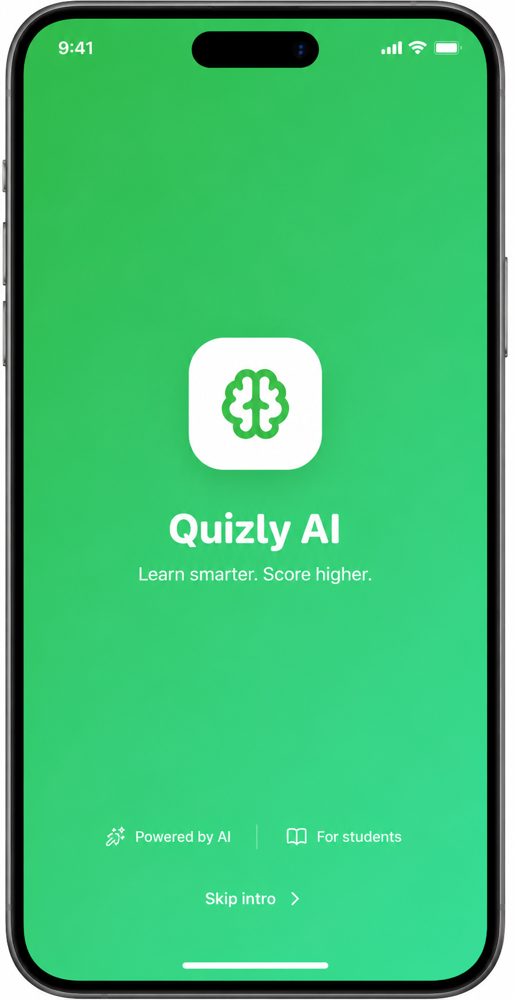
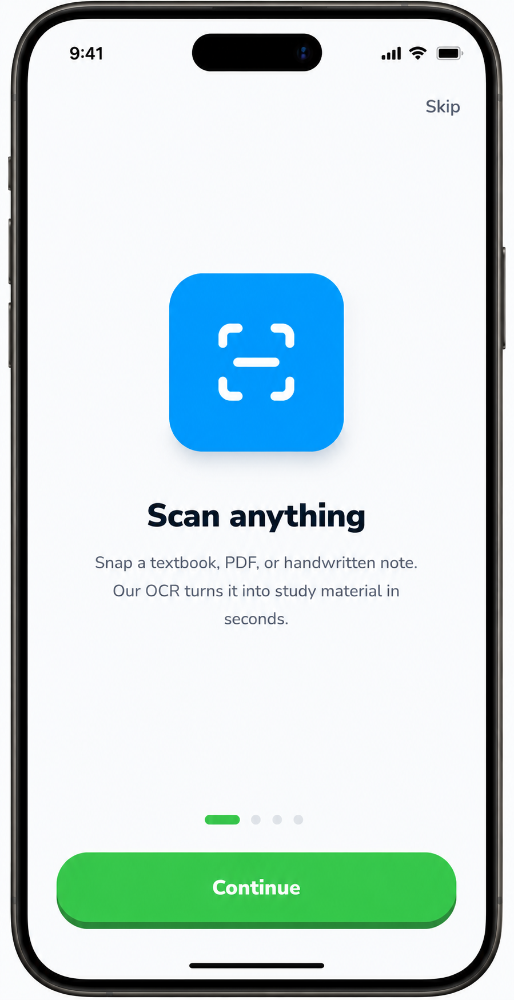
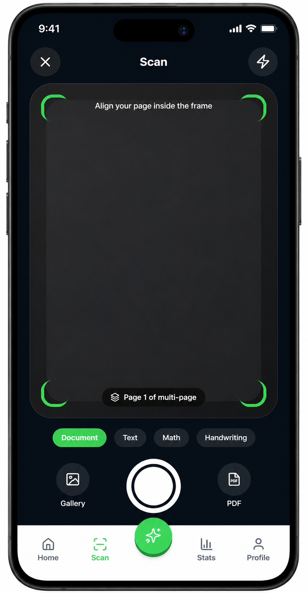
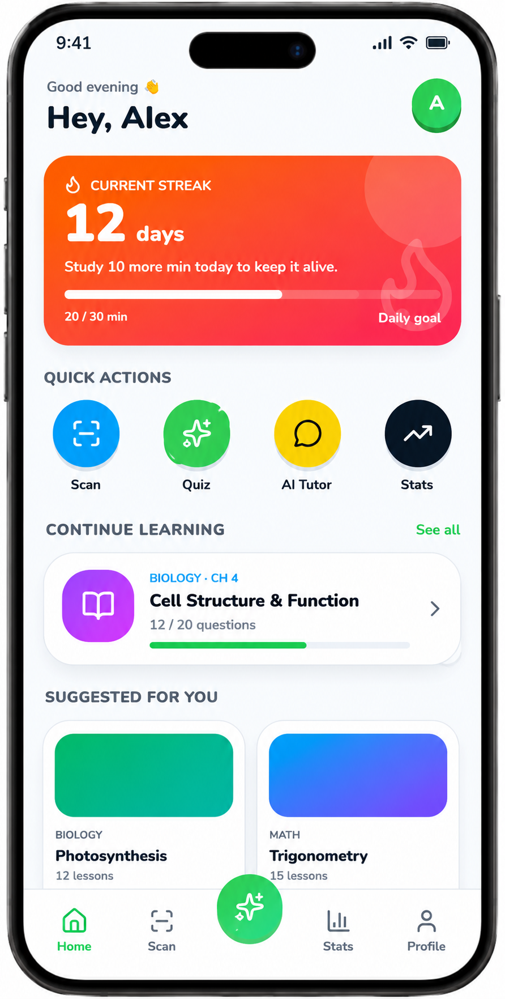
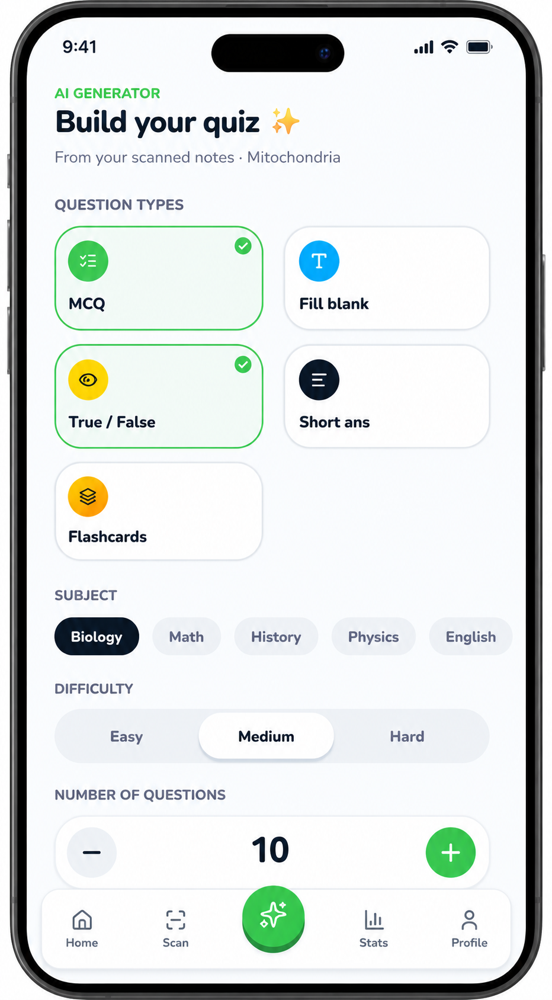

# AlExamMentor - AI-Powered Exam Preparation Platform


## 📸 Screenshots

| | |
|---|---|
|  |  |
|  |  |
|  | |

AlExamMentor is an enterprise-grade Android application designed to revolutionize student learning. It leverages cutting-edge AI (Gemini Pro) and OCR (ML Kit) to transform study materials into interactive quizzes, revision notes, and flashcards.

---

## 🚀 Key Features

- **Multi-Source Material Upload**: Support for PDF, DOC, TXT, and textbook images.
- **AI-Powered Generation**:
    - Multiple Choice Questions (MCQs)
    - Fill in the Blanks & True/False
    - Short & Long Answer Questions
    - Revision Notes & Flashcards
- **Advanced OCR**: Multi-language text extraction using ML Kit and CameraX.
- **Smart Quizzes**: Timed assessments with auto-scoring and performance analytics.
- **Subscription Model**: Tiered access (Free/Premium) with Google Play Billing integration.
- **Cloud Sync**: Cross-device history and progress backup via Firebase.

---

## 🛠 Tech Stack

- **UI**: Jetpack Compose (Material 3, Adaptive Layouts)
- **Architecture**: MVVM + Clean Architecture + Modular Structure
- **Dependency Injection**: Hilt
- **AI Engine**: Gemini Pro (Google AI SDK)
- **OCR**: Google ML Kit + CameraX
- **Local DB**: Room (Offline-first approach)
- **Networking**: Retrofit + Kotlin Serialization
- **Concurrency**: Coroutines + Flow
- **Analytics & Auth**: Firebase (Auth, Firestore, Analytics)
- **Monetization**: Google Play Billing + Stripe

---

## 🏗 Architecture & Folder Structure

The project follows strict **Clean Architecture** principles to ensure scalability and testability.

```text
com.example.alexammentor
 ├── core                # Global components (DB, Navigation, Theme, Prompts)
 ├── data                # Repository implementations & Data sources
 ├── domain              # Use cases & Business models (Pure Kotlin)
 ├── di                  # Hilt Dependency Injection Modules
 ├── feature_ai          # Gemini integration & Result parsing
 ├── feature_ocr         # CameraX & ML Kit implementation
 ├── feature_quiz        # Quiz engine & Analytics
 ├── feature_subscription # Billing & Feature gating
 └── feature_auth        # Firebase Authentication
```

---

## ⚙️ Setup & Installation

### 1. Prerequisites
- Android Studio Ladybug (or newer)
- JDK 17+
- Gemini API Key ([Get it here](https://aistudio.google.com/app/apikey))

### 2. Configuration
Add your API key to `local.properties`:
```properties
GEMINI_API_KEY=your_actual_api_key_here
```

### 3. Build
Sync Gradle and run the `:app:assembleDebug` task.

---

## 🧠 AI Prompt System

Our system uses a robust prompt engine to ensure high educational accuracy and structured JSON output.

**Example Prompt Logic:**
```text
SYSTEM: You are an expert AI Exam Preparation Engine.
USER: Analyze [CONTENT] and generate 10 MCQs with explanations.
FORMAT: Strict JSON only.
```

---

## 🔒 Security & Performance

- **SSL Pinning**: Secured network communication.
- **Encrypted Storage**: Sensitive data stored via `EncryptedSharedPreferences`.
- **R8/Proguard**: Optimized for production obfuscation.
- **Offline Caching**: All generated materials are cached in Room for data saving.

---

## 📈 Roadmap

- [ ] Support for Audio-to-Notes (AI Transcription).
- [ ] Collaborative Study Rooms.
- [ ] Advanced Weak Topic Analysis using ML.
- [ ] iOS Version (KMP Migration).

---

## 📄 License

This project is licensed under the MIT License - see the [LICENSE](LICENSE) file for details.

---

**Developed with ❤️ by the AlExamMentor Team.**
